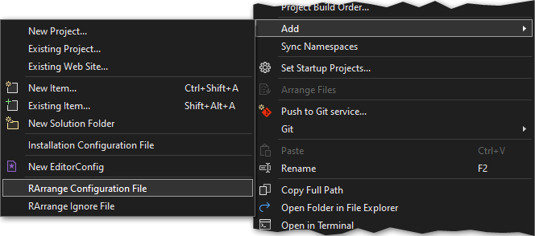

# Add a new configuration file

If not already present you can add a ready-to-go configuration file via **Add → RArrange Configuration File** in the context menu of the solution node in the Solution Explorer.

