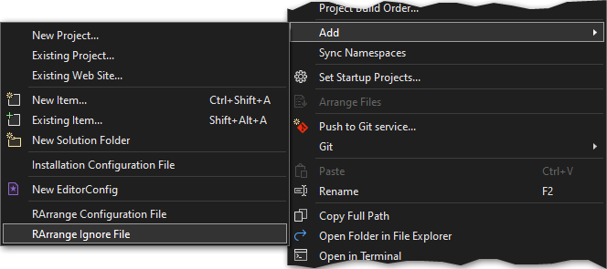

# Ignore File

Adding an ignore file lets you exclude files and directories from being arranged. A common use case is the exclusion of code from submodules that follows a different style guide.

The ignore file (_rarrange-ignore.txt_) must be located next to the solution file and consists of glob patterns that are evaluated relative to the solution directory.

If not already present you can add an empty ignore file via 'Add -> RArrange Ignore File' in the context menu of the solution node in the Solution Explorer.

## Examples

| Pattern     | Description                                                           |
|-------------|-----------------------------------------------------------------------|
| dir/        | Ignores all files in the directory _dir_ and all its subdirectories.  |
| dir/file.cs | Ignores the file _file.cs_ in the directory _dir_.                    |
| *.cs        | Ignores all files with a _.cs_ extension.                             |
| \*file\*.cs | Ignores all _.cs_ files with the word _file_ in the filename.         |
| dir/**/*.cs | Ignores all _.cs_ files in all subdirectories of the directory _dir_. |

## See Also

- [File globbing in .NET](https://docs.microsoft.com/en-us/dotnet/core/extensions/file-globbing#pattern-formats)
